この資料なんですか？: 数ヶ月前まで書籍を購入することを検討していなくて、やっぱり購入しようとなったので、無駄に余ってしまった資料です。基本書籍の内容をベースにしているので被る部分も多いかと思います。

すでに配布した書籍は非常に優秀で、TLSに関する大抵のことはこの書籍から学べます。
一方で、TLSのデータ構造など実際の通信に用いられるバイト列や、そもそもの前提となる知識は本書籍からは得ることができません。その部分を講義で補いたいと考えています。

# イントロダクション

現代ではコンピュータ以外にも様々なモノがインターネットに接続されています。
車や掃除機、洗濯機といった家電、今や街やインフラもインターネットに接続されています。

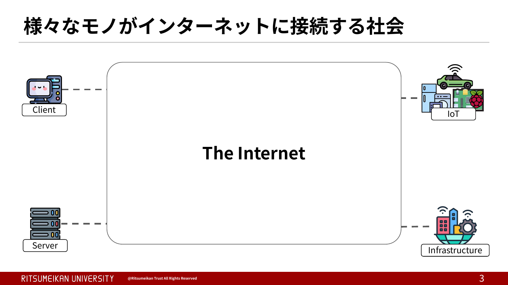

まず、インターネットの正体について知る必要があります。
インターネットは、どこかに実体が一つ存在するものではありません。無数のコンピュータが有線・無線で相互に接続されることで形成される、巨大なコンピュータ・ネットワークの集合体です。
このネットワークは、単一の組織が運営しているわけではありません。スライドに示すように、NTTドコモや楽天モバイルなどのモバイル回線事業者、NTTやKDDIなどのISP、AWSやGoogle Cloudなどのクラウド事業者、GoogleやMeta、Netflixなどのコンテンツ事業者、AkamaiやCloudflareなどのCDN事業者、そして事業者同士の相互接続点を提供するIX事業者など、役割の異なる多様な組織がネットワークを持ち寄り、相互に接続することで成り立っています。近年ではStarlinkのような衛星通信事業者も加わり、現在は約8万の組織がインターネットに参画しています。
（約8万の組織とはいいつつも、これはAS番号の割り当て数を基に述べているため、AS番号を複数持つ組織が存在する以上正確ではありません）

こうした自律的なネットワーク同士がバラバラにならないよう、IPアドレスやAS番号といった共通の資源は、IANAおよびその配下のAPNIC、JPNICといった組織によって階層的に管理されています。
かつてインターネットの中心はISPであり、コンテンツ事業者はISPの回線を借りてサービスを提供する立場でした。しかし現代では、GoogleやMeta、Netflixといったコンテンツ事業者が世界のトラフィックの大部分を生み出す存在となり、自前で海底ケーブルやデータセンター、CDNを保有するなど、力関係が逆転しつつあります。インターネットの構造を理解するうえでは、この「誰がネットワークを支えているのか」という勢力図の変化も重要な視点となります。

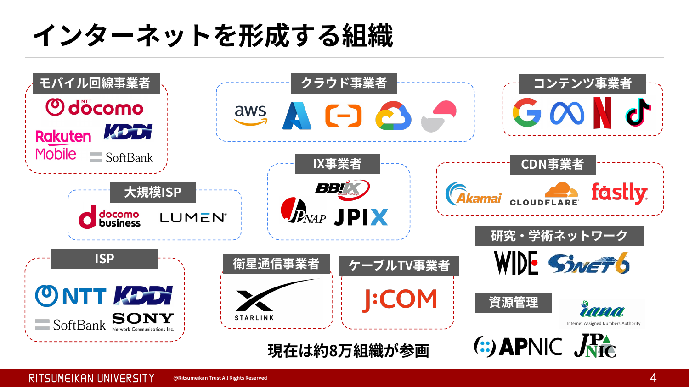

しかし、様々な組織が自由に参画している以上、悪意のある組織もこのインターネットに紛れ込んでいます。AS番号は個人でも取得できるため、参画しているすべての組織が善良であるとは限りません。

インターネット空間は想像以上に危険な場所であると言えます。悪い人たちが、なりすましや通信内容の監視をたくらんでいる可能性もあります。

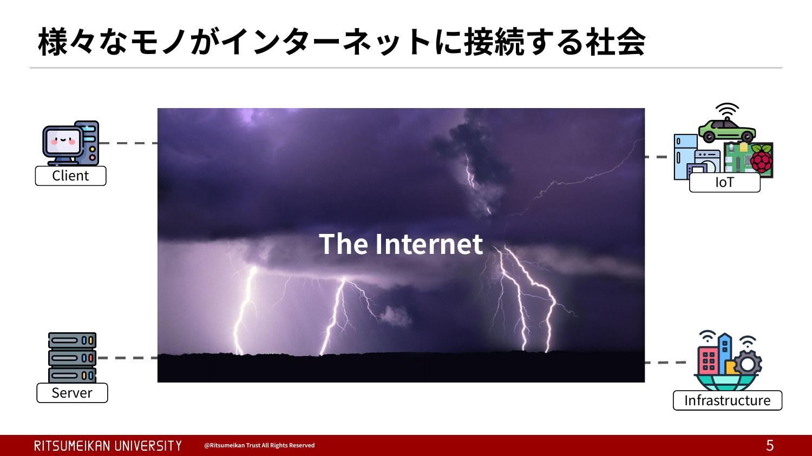

こういった危険なインターネットで安全に通信をするために用いられるのがTLSです。

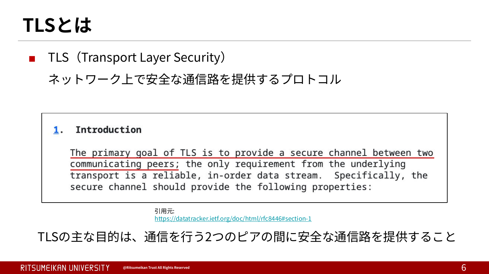

TLSの歴史的な経緯については、書籍にも詳しく掲載されています。ここでは、「TLSはSSLの後継として策定されたプロトコル」であることを押さえていただければ十分です。

現在でも、WebサイトでTLSによる暗号化通信を有効にすることを「SSL化」と呼んだり、TLSで利用するサーバー証明書を「SSL証明書」と呼んだりすることがあります。これらはSSL時代の名残として現在も広く使われている呼び方です。ただし、現在のWebサイトでSSLが使用されることはまずなく、「SSL」という名称が使われていても、実際にはTLSが利用されていると考えて問題ありません。

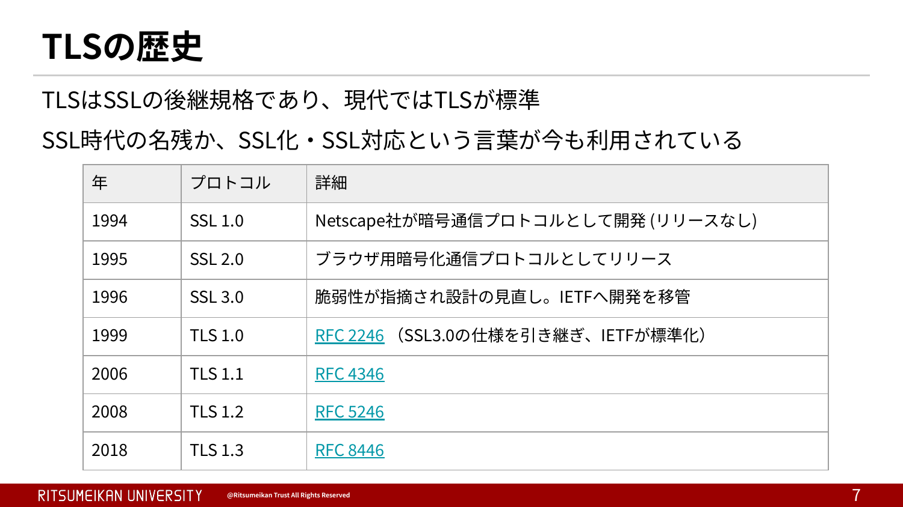

TLSは、通信の機密性・完全性・認証を提供します。
それぞれがどのような役割を果たしているのかは、保証されていない状況を考えた方が理解しやすくなります。そこで次に、これらが失われた場合に起こる問題を見ていきます。

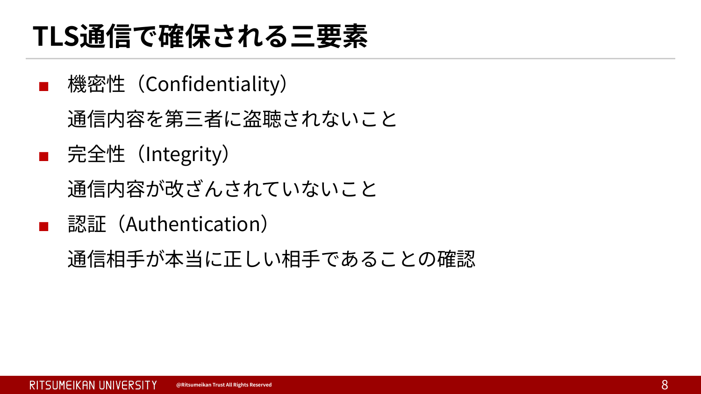

通信の機密性が担保されていない世界を考えてみましょう。
インターネット上の通信は、宛先に届くまでに多くのルーターやネットワーク機器を経由します。
そのため、もし通信が平文で行われていると、経路上にいる攻撃者が中間者攻撃によって通信内容を盗み見ることができます。
例えば、IDやパスワード、個人情報などがそのまま漏えいしてしまう危険があります。

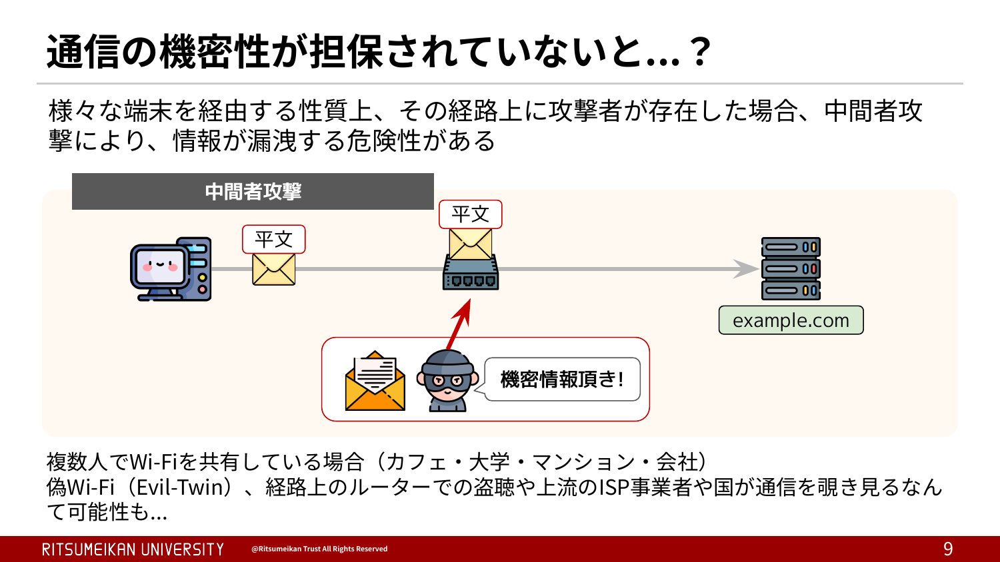

tracerouteコマンドを使用すると、宛先のIPアドレスへ到達するまでに経由するルーターやサーバーなどのネットワーク機器を確認できます。
このスライドでは、example.comへアクセスした際の実行結果を示しています。ローカルのWi-Fiルーターから始まり、ISPやバックボーンネットワーク上の複数のルーターを経由して、最終的にWebサーバーへ到達していることが分かります。
このように、インターネット上の通信は相手と直接やり取りしているわけではなく、多くのネットワーク機器を経由して届けられています。
もし通信が暗号化されていなければ、これらの経路上に存在する機器が悪意を持った第三者の支配下にあった場合や、攻撃者に侵害されていた場合、通信内容を盗み見られる可能性があります。

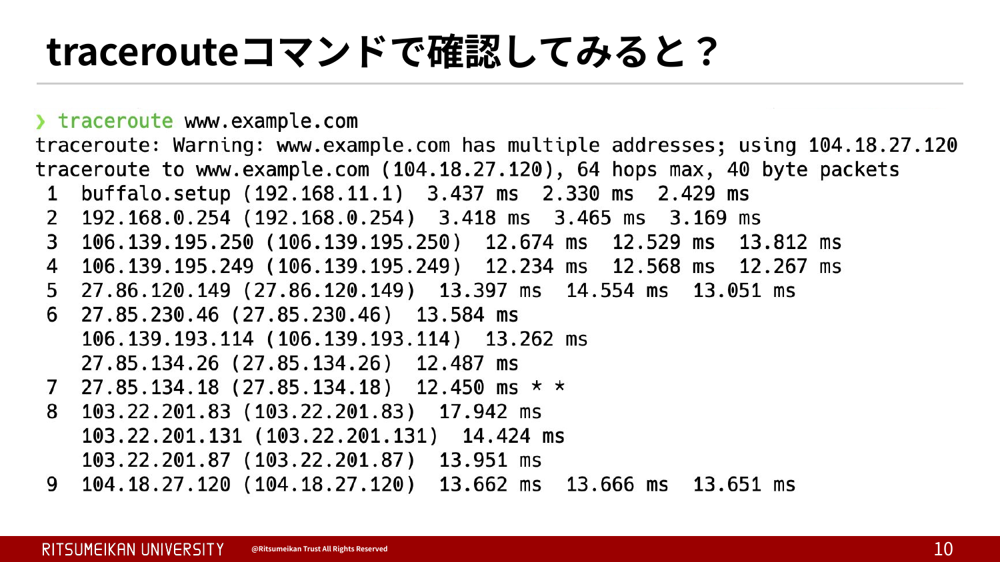

「盗聴なんて、現実にはほとんど起こらないのでは？」と思う方もいるかもしれません。
しかし、実際には通信の盗聴が大規模に行われていたことが明らかになった事例があります。
代表的なのが、2013年に明らかになったスノーデン事件です。
元CIA職員で、当時NSAの委託企業の社員であったエドワード・スノーデン氏は、NSAがPRISMと呼ばれる計画のもと、大手IT企業などから通信データを収集し、大規模な監視活動を行っていたことを暴露しました。
この事件は世界中に大きな衝撃を与え、「通信内容は誰かに見られる可能性がある」という認識を広めるきっかけとなりました。
もちろん、この事件は国家レベルの特殊な事例ではありますが、「通信経路上で情報が盗み見られる可能性は現実に存在する」ということを示す代表的な例と言えます。だからこそ、TLSによる通信の暗号化が重要になります。

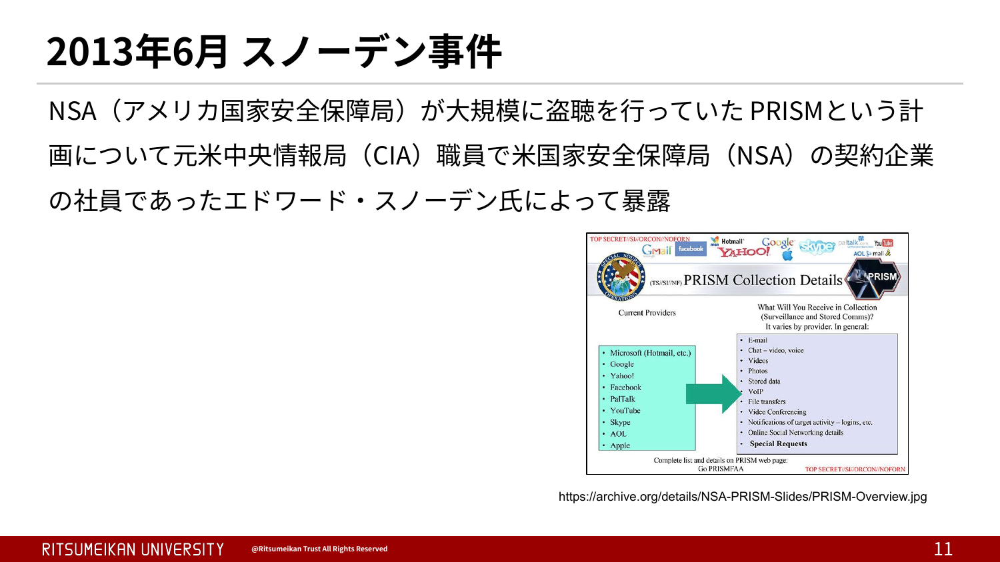

次に、完全性が保証されていない状況を考えてみましょう。
通信が暗号化されているかどうかにかかわらず、通信経路上でデータが改ざんされる可能性があります。
この改ざんを検知できなければ、送信したリクエストや受信したレスポンスが意図しない内容に書き換えられていても気付くことができません。
例えば、送信したリクエストの内容が第三者によって変更され、サーバーで本来とは異なる処理が実行される可能性があります。

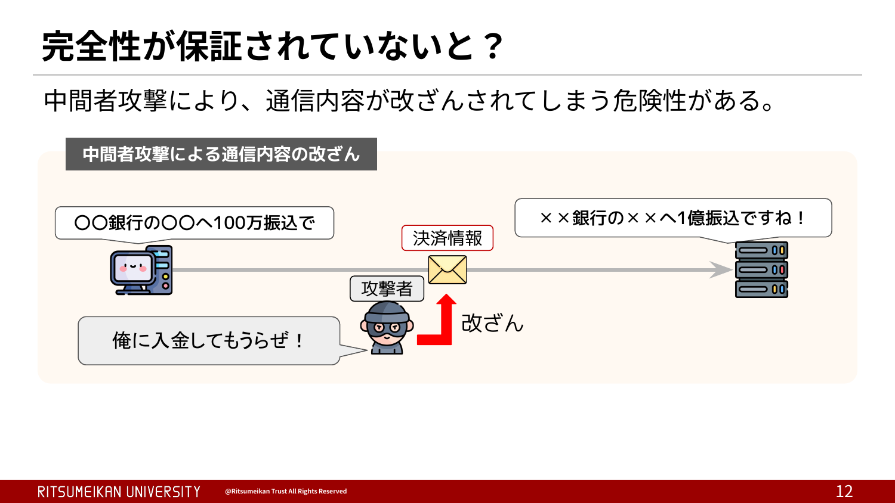

次に、認証が保証されていない世界を考えてみましょう。
認証が行われていないと、通信相手が本当に目的のWebサイトなのかを確認することができません。
そのため、攻撃者が正規のWebサイトになりすまして通信を行うことが可能になります。
利用者は本物のexample.comにアクセスしているつもりでも、実際には攻撃者が用意した偽のWebサイトと通信しているかもしれません。
この状態でIDやパスワード、クレジットカード情報などを入力してしまうと、それらの情報は攻撃者に盗まれてしまいます。

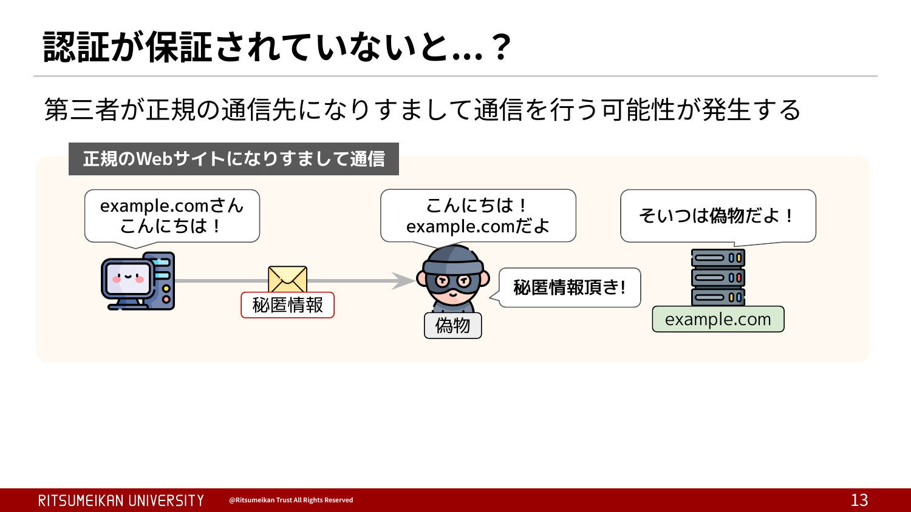

待ってください。そもそもなりすましなんていつ発生するんですか？と、突っ込みたくなりますよね。ケースとして考えられるものを、何個か挙げてみましょう。
1つ目が、DNSの侵害です。仮にDNSの応答が偽装されると、正しい名前のまま、偽のIPに誘導されてしまいます。利用者からすると、名前も画面もいつもどおりなので、なかなか気づけません。
有名な攻撃手法だと、DNSキャッシュポイズニング、DNSスプーフィングなどがあります。あるいは単純にDNSサーバーを侵害して設定をいじったりと、いろんな方法があります。
次は、ちょっと別のところが乗っ取られるケースを見てみましょう。

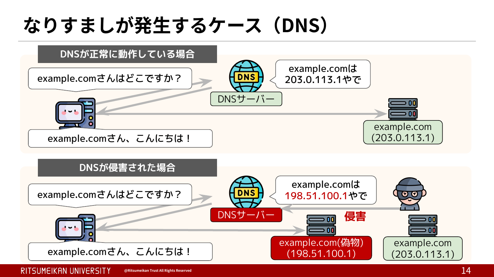

2つ目が、経路ハイジャックです。
今度はIPはすり替わりません。利用者はちゃんと正しいIP、203.0.113.1と通信しようとしています。ところが、「そのIPはこっちですよ」という経路の案内のほうが偽られると、同じIP宛の通信がまるごと攻撃者のところに吸い込まれてしまいます。IPは同じなのに、届く先だけが変わる、というのがミソですね。これは一般にBGPハイジャックと呼ばれています。
実際の例だと、2018年、攻撃者がAWSのDNSサービスであるRoute 53が管理するIPアドレスの経路情報を、BGPで不正に広告しました。するとRoute 53宛の通信が攻撃者の偽DNSサーバーに流れ込んで、仮想通貨ウォレットのMyEtherWalletの利用者が偽サイトに誘導され、約15万ドル相当のイーサリアムが盗まれました。

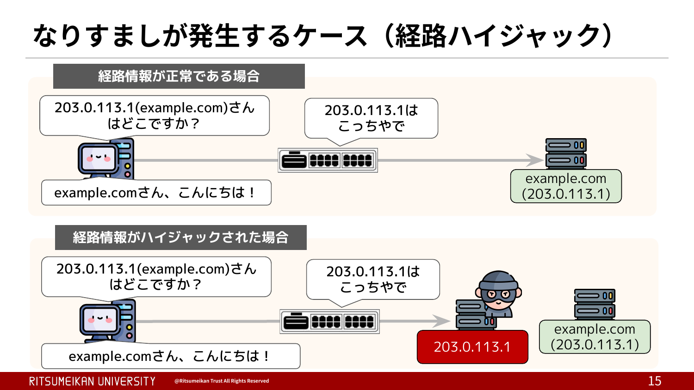

http://abehiroshi.la.coocan.jp/
を開いてみてください。

ここで質問です。今みなさんが開いたこのページ、アドレスは「abehiroshi.la.coocan.jp」となっていますよね。これが本当に目的のWebサイトなのか、どうやって見分けたらいいでしょうか。

SSL/TLSを使っていない、平文のサイトの場合、それが本物かどうか、利用者はどうやって見分ければいいんでしょうか。
まずドメイン名を見るだけでは見分けられません。さっきの例のように、本物と同じ名前のまま偽サイトに連れていかれることがあるからです。
じゃあ何か手はないのか、というとアイデア自体はあります。たとえば、正規のIPアドレスをあらかじめ記録しておいて照合する。あるいは通信経路を記録しておいて、明らかにおかしな経路を通ったら検知する。ETagというのを使ってコンテンツが変わっていないか確認する、といった具合です。
ただ、どれも一般の人には現実的じゃないですよね。正規のIPを事前に知っておく必要があったり、経路を観測する手段がなかったり、そもそも専門的な知識と継続的な監視が前提になってしまう。
結局、平文のサイトでは、普通の利用者がなりすましを見分けるのはほぼ不可能だ、というのが結論です。

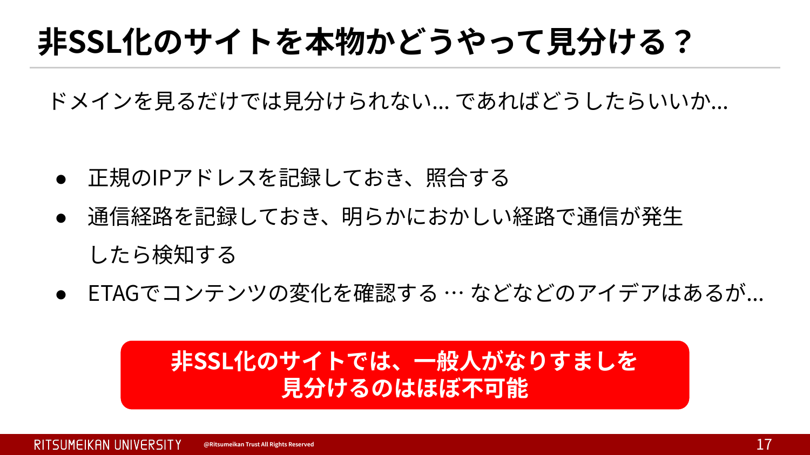

ということでイントロはこれくらいにして、当日の講義では、どのようにTLSがこれらの危険から我々を守っているのか、その中身に踏み込んでいきます。
今日のところは「Webにはこういう危険があって、TLSがそれを守ってくれているらしい」というイメージだけ頭の片隅に置いておいてもらえれば十分です。詳しい仕組みは、当日の講義でじっくりやりましょう。

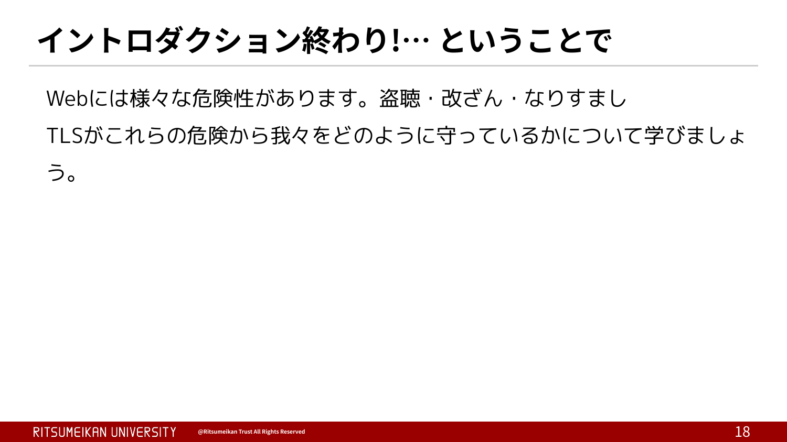

## 参考文献

[1]  株式会社NTTドコモ. "NTTドコモ". https://www.docomo.ne.jp/, (参照 2026-08-15).  
[2]  楽天モバイル株式会社. "楽天モバイル". https://network.mobile.rakuten.co.jp/, (参照 2026-08-15).  
[3]  KDDI株式会社. "KDDI株式会社". https://www.kddi.com/, (参照 2026-08-15).  
[4]  ソフトバンク株式会社. "ソフトバンク". https://www.softbank.jp/, (参照 2026-08-15).  
[5]  Amazon Web Services, Inc. "AWS". https://aws.amazon.com/jp/, (参照 2026-08-15).  
[6]  Microsoft Corporation. "Microsoft Azure". https://azure.microsoft.com/ja-jp/, (参照 2026-08-15).  
[7]  Google LLC. "Google Cloud". https://cloud.google.com/, (参照 2026-08-15).  
[8]  Google LLC. "Google". https://about.google/, (参照 2026-08-15).  
[9]  Meta Platforms, Inc. "Meta". https://about.meta.com/, (参照 2026-08-15).  
[10] Netflix, Inc. "Netflix". https://www.netflix.com/, (参照 2026-08-15).  
[11] ByteDance Ltd. "TikTok". https://www.tiktok.com/, (参照 2026-08-15).  
[12] NTTドコモビジネス株式会社. "NTTドコモビジネス". https://www.ntt.com/, (参照 2026-08-15).  
[13] Lumen Technologies, Inc. "Lumen". https://www.lumen.com/, (参照 2026-08-15).  
[14] BBIX株式会社. "BBIX株式会社". https://www.bbix.net/, (参照 2026-08-15).  
[15] インターネットマルチフィード株式会社. "JPNAP". https://www.jpnap.net/, (参照 2026-08-15).  
[16] 株式会社JPIX. "株式会社JPIX". https://www.jpix.ad.jp/, (参照 2026-08-15).  
[17] Akamai Technologies, Inc. "Akamai". https://www.akamai.com/ja, (参照 2026-08-15).  
[18] Cloudflare, Inc. "Cloudflare". https://www.cloudflare.com/, (参照 2026-08-15).  
[19] Fastly, Inc. "Fastly". https://www.fastly.com/, (参照 2026-08-15).  
[20] 日本電信電話株式会社. "NTT". https://group.ntt/jp/, (参照 2026-08-15).  
[21] ソニーネットワークコミュニケーションズ株式会社. "So-net". https://www.sonynetwork.co.jp/, (参照 2026-08-15).  
[22] Space Exploration Technologies Corp. "Starlink". https://www.starlink.com/, (参照 2026-08-15).  
[23] JCOM株式会社. "J:COM". https://www.jcom.co.jp/, (参照 2026-08-15).  
[24] WIDEプロジェクト. "WIDE Project". https://www.wide.ad.jp/, (参照 2026-08-15).  
[25] 国立情報学研究所. "学術情報ネットワーク SINET6". https://www.sinet.ad.jp/, (参照 2026-08-15).  
[26] Internet Assigned Numbers Authority. "IANA". https://www.iana.org/, (参照 2026-08-15).  
[27] Asia Pacific Network Information Centre. "APNIC". https://www.apnic.net/, (参照 2026-08-15).  
[28] 一般社団法人日本ネットワークインフォメーションセンター. "JPNIC". https://www.nic.ad.jp/, (参照 2026-08-15).  

