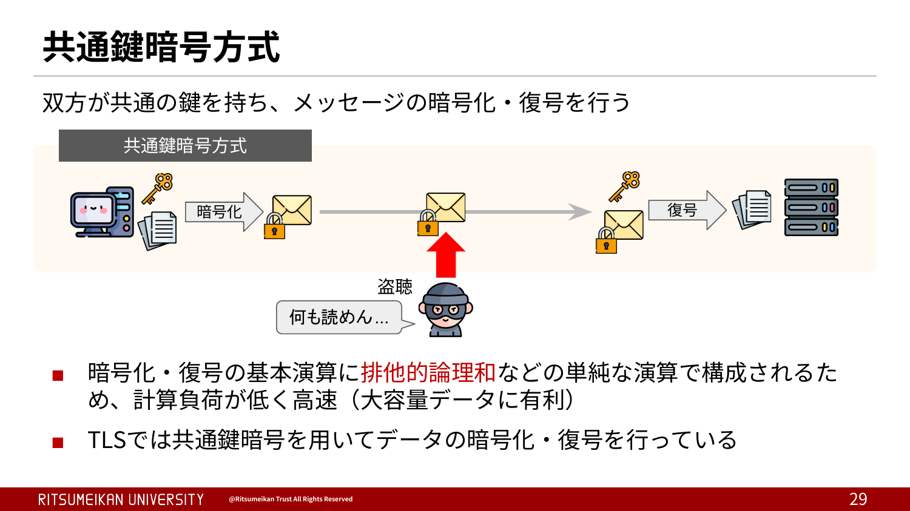
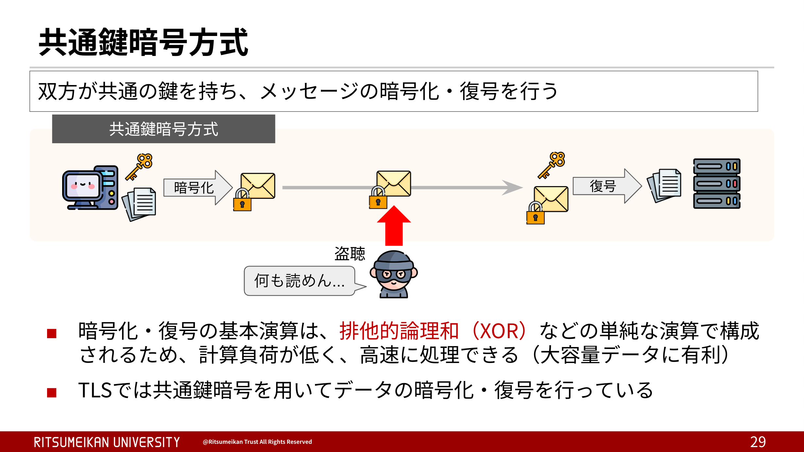
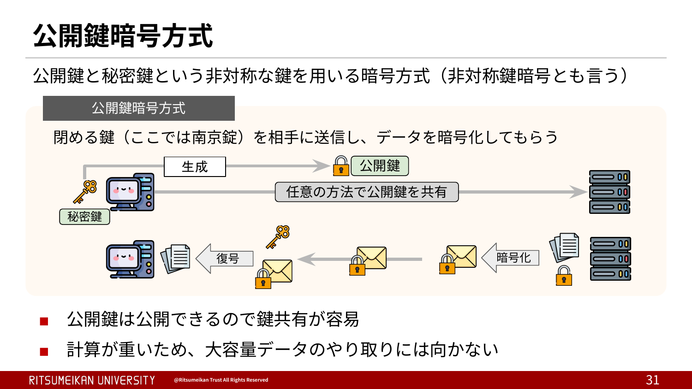
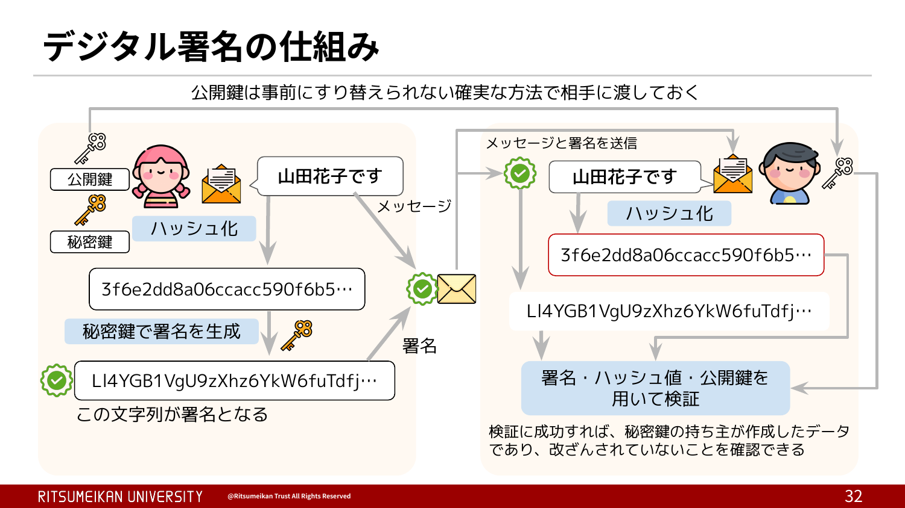
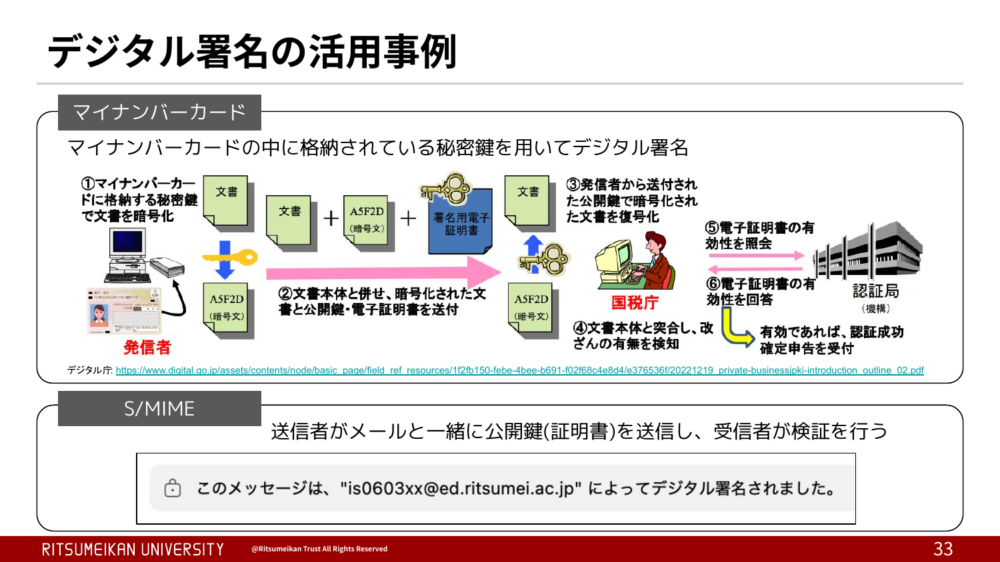

# 事前学習

## 目次

- [暗号関連](#暗号関連)
  - [古典暗号](#古典暗号)
  - [現代暗号](#現代暗号)
  - [共通鍵暗号](#共通鍵暗号)
  - [公開鍵暗号](#公開鍵暗号)
  - [デジタル署名](#デジタル署名)
- [その他](#その他)
  - [OSI参照モデル](#osi参照モデル)
  - [DNS](#dns)
  - [TCP・UDP](#tcpudp)

## 暗号関連

公開鍵暗号と共通鍵暗号という基本的な暗号の部分に関しては、知っている前提で進めて行きたい！

### 古典暗号

暗号は大きく「古典暗号」と「現代暗号」の2つに分類できます。コンピュータの普及を境に分ける時代的な分類もありますが、より本質的な違いは、暗号の安全性をどのように実現しているかにあります。古典暗号が暗号化・復号の仕組み自体を秘密にすることで安全性を確保していたのに対し、現代暗号はアルゴリズムを公開しても安全性が損なわれないことを前提とし、秘密にするのは鍵だけです。

古典暗号の代表例として、次のようなものが挙げられます。

- スキュタレー暗号
- シーザー暗号
- ヴィジュネル暗号

### 現代暗号

前節で述べたとおり、現代暗号はアルゴリズムが完全に公開されていても、鍵さえ秘密であれば安全性が保たれるように設計されています。この原則はケルクホフスの原理と呼ばれ、現代暗号の大前提になっています。実際、AESやChaCha20といった対称鍵暗号も、SHA-256のようなハッシュ関数も、仕様はすべて公開されています。

では、仕組みが公開されているのに、何が安全性を支えているのでしょうか。考え方は次の2つに分けられます。

|  | 計算量的安全性 | 情報理論的安全性 |
|---|---|---|
| 考え方 | 解読に必要な計算が現実的な時間では終わらないほど計算量が大きい | 暗号文をいくら解析しても、数学的に元の情報が一切得られない |
| 条件 | 安全性を保ちたい期間内に解読が完了しないこと | 平文と同じ長さの完全にランダムな鍵を、一度しか使わないこと |
| 代表例 | AESなど、現代の暗号技術の大半 | ワンタイムパッド（シャノンが安全性を証明） |

情報理論的安全性はいわば究極の安全性ですが、鍵の制約が強すぎて実用が難しいため、実際に使われている暗号のほとんどは計算量的安全性に立脚しています。

それでも、頑張って仕組みを隠し通せば安全なのではないか、と思うかもしれません。しかし、隠蔽による安全性は時間の問題であることを歴史が証明しています。

| 事例 | 何が起きたか |
|---|---|
| MIFARE Classic（ICカード） | 独自暗号Crypto-1がリバースエンジニアリングで解析され、カードのクローンや改ざんが可能に |
| RC4（RSA社） | アルゴリズムが企業秘密として非公開だったが、1994年に何者かがソースコードをインターネットへ投稿し、世界中に拡散 |
| CSS（DVDのコピーガード） | 保護の仕組みが解析され、解除プログラムDeCSSの公開により実質的に無効化 |

### 共通鍵暗号

共通鍵暗号方式（対称鍵暗号）は、通信する2者が同じ鍵を持ち、その鍵で暗号化と復号を行う方式です。
暗号化・復号は排他的論理和などの単純なビット演算を組み合わせて行われるため、計算負荷が低く高速に処理できます。TLSでは、アプリケーションデータの暗号化にこの共通鍵暗号方式が使われています。

先ほど登場した排他的論理和（XOR）について補足します。
ビット演算に馴染みがないと少し難しく感じるかもしれませんが、排他的論理和は、2つの値が異なるときに1、同じときに0を出力する論理演算です。
図のように、暗号化されたデータに同じ鍵をもう一度XORするだけで、元のデータを正しく復元できます。XORは情報を一切失わない可逆な演算だからです。
この性質は、ストリーム暗号や、ブロック暗号をCTRモードなどで利用する場合の暗号化・復号に利用されています。

### 公開鍵暗号

公開鍵暗号方式は、共通鍵暗号と並んでよく知られた暗号方式で、非対称鍵暗号とも呼ばれます。
暗号化専用の鍵（公開鍵）と、復号専用の鍵（秘密鍵）をペアで用意し、データを送信したい側は公開鍵を用いて暗号化します。
そして受け取り側は秘密鍵を使って復号し、データを見ます。公開鍵は暗号化にしか使えないため、第三者に知られても盗聴の役には立ちません。そのため、盗聴の恐れがある危険な通信路でも安心して相手に渡せます。ただし、通信経路上で公開鍵そのものがすり替えられないようにする対策は必要です。
公開鍵暗号は鍵の共有が容易である一方、共通鍵暗号に比べて計算が重く、大容量データのやり取りには向きません。そのためTLSでは、データ本体の暗号化は共通鍵暗号が担い、公開鍵暗号の技術はその鍵を安全に共有する用途などに使われています。

### デジタル署名

公開鍵暗号の技術を応用したものの一つに、デジタル署名があります。
TLSではデジタル署名が何度も登場するため、ここで概要を押さえておくと理解しやすくなります。
デジタル署名は、署名の作成と検証という2つの操作から成ります。
署名者は、メッセージ（実際にはそのハッシュ値）に対して秘密鍵を使って署名を作成し、メッセージと署名をセットで相手に送ります。
受け取った側は、メッセージ・署名・公開鍵の3つを検証アルゴリズムに入力し、これらが正しい数学的関係にあるかを確かめます。検証の結果として得られるのは、成功か失敗かの判定だけです。
「秘密鍵で暗号化し、公開鍵で復号する」と説明されることもありますが、実際に行われているのは暗号化・復号ではありません。ECDSAなど現在主流の署名方式では、署名から何かを取り出すことはできず、関係式が成立するかどうかを検証しています。
検証に成功すれば、そのデータを対応する秘密鍵の所有者が作成したこと、そして署名後にデータが改ざんされていないことを確認できます。

デジタル署名は身近なところでも使われています。例えばマイナンバーカードには署名用の秘密鍵が格納されており、電子申請した文書を本人が作成したことの証明に使われています。また、S/MIMEという規格では、メールにデジタル署名を付けることで送信者のなりすましや改ざんを検知できます。

## その他

暗号以外に学んでおくと良いものをまとめます。

### OSI参照モデル

OSI参照モデルとは、コンピュータネットワークにおける通信機能を7つの階層に分割し、それぞれの役割を整理・標準化した概念モデルです。

図を丸暗記する必要はありません。送信するデータが上の層から下の層へ順に渡されて送り出され、受信側では逆の順にさかのぼって処理される、という通信の大まかな流れをつかんでおけば十分です。

TLSは、トランスポート層（第4層）のTCPの上で動作し、そのさらに上を流れるHTTPなどのアプリケーションデータを暗号化します。セッションの管理も行っていることから、セッション層（第5層）に跨るプロトコルだと説明されることもあります。もっとも、OSI参照モデルはあくまで概念的な整理なので、TLSが厳密に何層なのかにこだわる必要はありません。TLSを理解する上で重要なのは、どこまでが暗号化されて、どこからが暗号化されないのかです。TLSが暗号化するのは自分より上を流れるデータだけで、自分より下にあるTCPやIPのヘッダーは平文のまま流れます。TOOL.mdのWiresharkでパケットを見たとき、IPアドレスやポート番号は読めるのにApplication Dataだけが暗号化されていたのは、このためです。

出典: https://www.sbbit.jp/article/cont1/12099

### DNS

DNSを知らない人は少ないと思いますが、自信がない場合は、ざっくりとどういう仕組みなのかを学んでおくと良いです。

詳しく学びたい場合、個人的には「[DNSがよくわかる教科書 第2版](https://www.sbcr.jp/product/4815622657/)」を読むのが良いと思います。今年の3月に第2版が出ました。

### TCP・UDP

トランスポート層の代表的なプロトコルであるTCPとUDPについても、それぞれがどんなプロトコルなのかをざっくりと理解しておくと良いです。

というのも、講義はTLSがTCPの上で動くことを前提に進むからです。RFC 8446のIntroductionには次のように書かれています。

> the only requirement from the underlying transport is a reliable, in-order data stream.
>
> 引用元: [RFC 8446 Section 1](https://datatracker.ietf.org/doc/html/rfc8446#section-1)

TLSが下位のトランスポートに要求するのは「信頼性のある、順序どおりのデータストリーム」だけであり、それを保証してくれるのがTCPです。細かい仕様まで覚える必要はありません。TCPがこの保証をどうやって実現しているのか、大まかにイメージできれば十分です。

なお、UDPの上でTLS 1.3の仕組みを取り込んだQUICというプロトコルもあり、HTTP/3で使われています。他にも、TLSをUDP上で利用できるようにしたDTLSというプロトコルも存在します。講義で扱うのはTCP上のTLSですが、名前だけ知っておくと良いでしょう。

