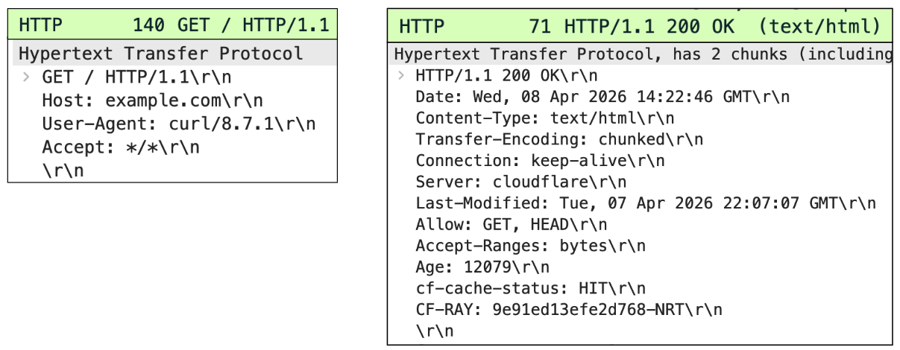
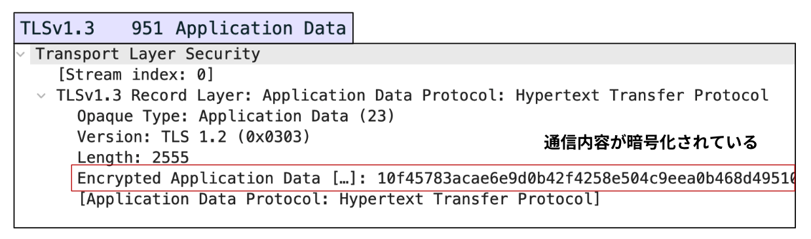
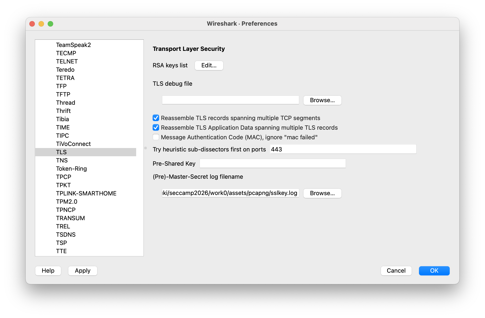
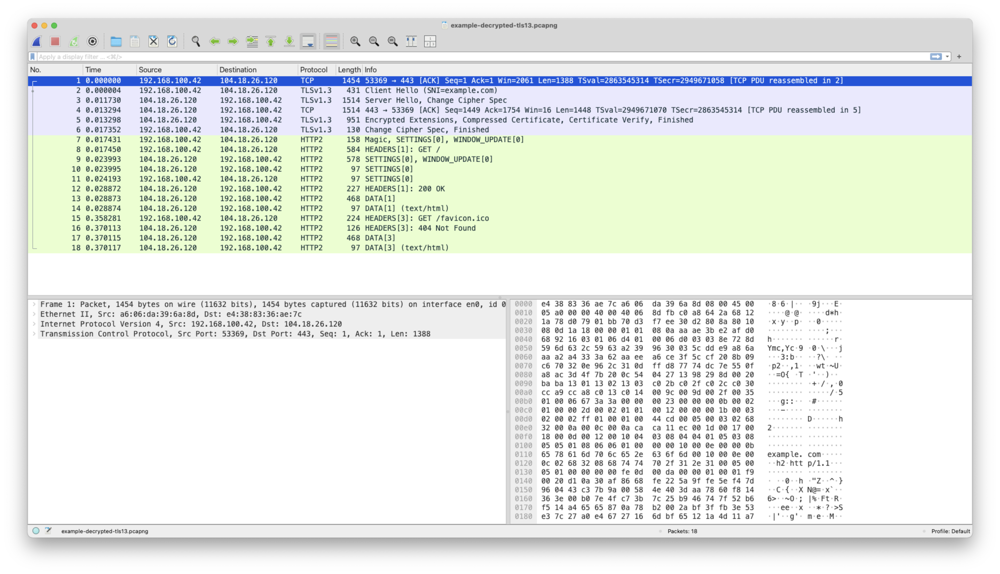

# ツールのインストール

## 目次

- [Wiresharkのインストール](#wiresharkのインストール)
- [ファイルの確認](#ファイルの確認)
- [鍵の設定](#鍵の設定)

## Wiresharkのインストール

講義でWiresharkを利用しようと考えているので、インストールをお願いします。

```bash | powershell
# Windowsでwingetを利用するケース
winget install -e --id WiresharkFoundation.Wireshark
```


```
# Macでbrewを利用するケース
brew install --cask wireshark
```

パッケージマネージャーを利用していない人は[公式サイト（https://www.wireshark.org/download.html）](https://www.wireshark.org/download.html)からダウンロードしてインストールしてください。

## ファイルの確認

[work0/assets/pcapng](assets/pcapng)の中にパケットを記録したファイルが配置されています。

まずは配布ファイルの[example_http.pcapng](./assets/pcapng/example_http.pcapng)を開いてHTTP通信を確認してみましょう。リクエストやレスポンスが確認できれば問題なしです。




次に[example-encrypted-tls13.pcapng](./assets/pcapng/example-encrypted-tls13.pcapng)を開いてTLS通信を確認してみましょう。
Application Dataのパケットを見てみると、通信内容が暗号化されていて何が書いてあるのか分からないようになっていることが確認できます。




## 鍵の設定

次にTLSで暗号化されたパケットを復号する設定をします。


[example-decrypted-tls13.pcapng](./assets/pcapng/example-decrypted-tls13.pcapng)を開いてください。
次にWiresharkのメニューから「Preferences > Protocols > TLS」の順に移動して
「(Pre)-Master-Secret log filename」に、配布したファイルの[sslkey.log](./assets/pcapng/sslkey.log)を設定してください。





問題なく設定できていれば、以下のようにパケットが黄緑色で表示されるようになります。



ここまで設定できればOKです。Wiresharkは当日も利用するので削除しないようにお願いします。